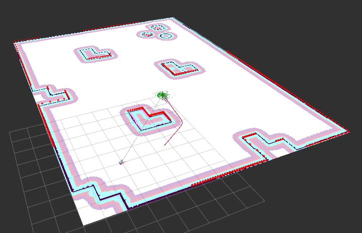

# 🧭 Navigation Bringup Launch



This ROS 2 launch file sets up the full Nav2 navigation stack along with optional RViz visualization, SLAM, and parameter configurations. Designed to work with both real and simulated robots.


## 💡 What It Does

- Declares all the standard launch args for Nav2.
- Launches the full navigation stack via `nav2_bringup`.
- Optionally launches RViz for visualization.
- Can run either with SLAM or a pre-saved map.

## 🧑‍💻 Setup

1. 📂 Clone the repository
```
mkdir -p ~/ros_ws/src
cd ~/ros_ws/src
git clone  https://github.com/manojm-dev/navigation_bringup.git
```

2) 📦 Install dependencies
```
cd ~/ros_ws
sudo apt-get update -y && rosdep update && rosdep install --from-paths src --ignore-src -y
```

3) 🛠️ Building the packages
```
cd ~/ros_ws
colcon build
```

## 🧾 How to Launch

```bash
ros2 launch navigation_bringup bringup.launch.py
```

### 🔧 Optional Args

| Argument           | Default                   | Description |
|--------------------|----------------------------|-------------|
| `use_sim_time`     | `true`                     | Use simulation time from Gazebo |
| `slam`             | `False`                    | Run SLAM toolbox instead of loading a map |
| `map_yaml_file`    | `maps/six_waypoints.yaml`  | Map file to use if not running SLAM |
| `params_file`      | `config/nav2_params.yaml`  | Nav2 config file |
| `namespace`        | `""`                       | Top-level ROS namespace |
| `autostart`        | `true`                     | Auto-start lifecycle nodes |
| `use_composition`  | `True`                     | Use composed nodes in a single container |
| `use_respawn`      | `False`                    | Respawn crashed nodes (if composition is off) |
| `use_rviz`         | `true`                     | Launch RViz GUI |
| `rviz_config_file` | `rviz/config.rviz`         | RViz config path |


### 🔄 Example Command

```bash
ros2 launch navigation_bringup bringup.launch.py \
  slam:=True \
  use_sim_time:=true \
  use_rviz:=true
```

## 🧠 Notes

- If using a static map (`slam:=False`), verify your map file and initial pose.


## 👨‍💻 Author
Made with ❤️ by Manoj M